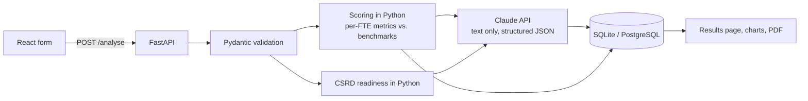

# SustainIQ

**AI-assisted sustainability assessment for German SMEs.** A company enters one year of
operational data and gets an EU sector benchmark comparison, a 0-100 sustainability score,
its CSRD/ESRS data readiness, AI-written recommendations, and a PDF report.

> **Live demo:** _link follows after deployment_
> (free hosting: the first request after a pause can take up to a minute to wake the server)

<!-- Screenshots: add after the first live run with a real API key, e.g.


-->

## Why

The EU Corporate Sustainability Reporting Directive (CSRD) extends structured sustainability
reporting to many more companies (its timeline and thresholds are currently being revised under
the EU Omnibus package). Even SMEs outside its scope feel it: large companies pass data requests
down their supply chain to smaller suppliers. Many SMEs do not know where they stand or which data
they are missing. SustainIQ gives a first, fast orientation:

- How do my energy use, emissions, waste and water compare to my sector?
- Which ESRS data points do I already have, and which are missing?
- What are sensible next steps, and which German funding programmes (KfW, BAFA) could help?

## Features

- **Assessment form** for 9 inputs: sector, employees (FTE), energy, renewable share,
  Scope 1+2 emissions, waste, recycling rate, water, plus an optional CSRD data checklist.
- **Benchmarking** of 6 metrics against sector values, normalised per employee (FTE).
- **Deterministic 0-100 score** per metric and overall, with a gauge and a bar chart.
- **CSRD data readiness** for 12 key ESRS data points (ESRS 2, E1, E2, E3, E5).
- **AI analysis** (Claude): summary, recommendations mapped to ESRS standards,
  CSRD gaps and quick wins, returned as validated structured JSON.
- **History and progress tracking**: every assessment is saved; a line chart shows how a
  company's score develops over time.
- **PDF report** for download.

## How it works



### Design decisions

- **Numbers in Python, words from AI.** The score and the benchmark comparison are calculated
  in plain Python, so they are deterministic, unit-tested and explainable. Claude only writes
  text about numbers it is given and is instructed never to invent or recalculate figures.
- **Structured AI output.** Claude's answer must match a Pydantic schema (Anthropic structured
  outputs), so the frontend never has to parse free text.
- **Graceful degradation.** If the AI call fails (network, rate limit, invalid key), the
  assessment still returns and saves the score; the page explains that the AI part is missing.
- **Honest data labels.** Every benchmark has a source. Estimated values are flagged
  `indicative` and shown as such in the UI and the PDF.
- **Per-FTE normalisation.** A company ten times larger with ten times the energy use gets
  the same score, so companies of different size compare fairly.

### Scoring method

Each metric is compared with its sector benchmark and scored from 0 to 100, where
**50 = exactly at the benchmark**:

| Metric type | 0 points | 50 points | 100 points |
|---|---|---|---|
| Lower is better (energy, CO2e, waste, water per FTE) | 2x benchmark or more | at benchmark | zero use |
| Higher is better (renewable %, recycling %) | 0 % | at benchmark | 100 % |

Values in between are interpolated linearly. The overall score is a weighted average:
Scope 1+2 emissions 30 %, energy 20 %, renewable share 20 %, waste 10 %, recycling 10 %,
water 10 %. Climate metrics weigh most because ESRS E1 (climate) is the core of CSRD.

## Tech stack

| Area | Technology |
|---|---|
| Frontend | React 19, Vite, Tailwind CSS 4, Recharts |
| Backend | Python 3.11, FastAPI, Pydantic v2 |
| AI | Anthropic Python SDK (Claude), model set via environment variable |
| Database | SQLAlchemy 2 with SQLite (local) and PostgreSQL (production) |
| PDF | ReportLab |
| Tests | pytest (104 backend tests) |
| Hosting | Vercel (frontend), Render (backend), Neon (PostgreSQL) |

## Project structure

```
backend/
  app/
    main.py         FastAPI app, routes, CORS
    models.py       Pydantic request/response schemas
    benchmarks.py   sector benchmarks, each with source and "indicative" flag
    scoring.py      per-FTE metrics, 0-100 score
    csrd.py         CSRD data checklist and readiness
    analyzer.py     prompt, Claude call, structured output
    database.py     SQLAlchemy models and queries
    report.py       PDF report
  tests/            pytest suite (no network calls, in-memory database)
frontend/
  src/
    api/client.js   every call to the backend
    pages/          AssessmentForm, Results
    components/     charts, cards, checklist, history
render.yaml         Render deployment blueprint
```

## Run locally

Requirements: Python 3.11+, Node.js 20.19+ or 22.12+ (required by Vite).

```bash
# Backend
cd backend
python -m venv .venv
.venv\Scripts\activate          # macOS/Linux: source .venv/bin/activate
pip install -r requirements.txt
copy .env.example .env          # macOS/Linux: cp .env.example .env
# edit .env: ANTHROPIC_API_KEY and CLAUDE_MODEL
uvicorn app.main:app --reload   # http://127.0.0.1:8000/docs

# Frontend (second terminal)
cd frontend
npm install
npm run dev                     # http://localhost:5173
```

Without a valid API key the app still works: scores, charts, history and PDF are complete,
only the AI text sections are replaced by a notice.

## Tests

```bash
cd backend
pytest
```

The tests cover input validation, benchmarks, scoring maths, the CSRD checklist, the API
routes, database queries and the PDF export. The Claude API is replaced by a fake client and
the database by an in-memory SQLite, so tests are fast, free and need no network.

## Deployment

- **Backend:** Render Blueprint from [`render.yaml`](render.yaml) (Frankfurt region, health
  check on `/health`). Secrets are entered in the Render dashboard, never committed.
- **Database:** Neon PostgreSQL (EU region), connected through `DATABASE_URL`.
- **Frontend:** Vercel with root directory `frontend` and `VITE_API_URL` set to the backend URL.

## Limitations

This is a portfolio project, not an audited reporting tool.

- **Benchmarks are indicative estimates** derived from Eurostat/UBA sector totals divided by
  employment, not official per-FTE statistics. They still need to be checked against the
  published source tables.
- **The CSRD checklist is simplified** (12 key data points, not the full ESRS). References follow
  ESRS Set 1 (2023); the EU is simplifying the ESRS (Omnibus package), so numbering and scope
  may change.
- **Companies are matched by name** for progress tracking; there are no user accounts yet.
- **Scope 3 emissions** are only covered as a checklist item, not as a calculated metric.
- **AI text can be wrong** and should be reviewed before use in any official report.

## Roadmap

- Verify benchmark values against the published Eurostat tables
- Scope 3 estimate from spend data
- User accounts with company IDs
- German language version

## Author

Porag Barua, B.Sc. student in Sustainable Resources, Engineering and Management,
Hochschule Magdeburg-Stendal.
